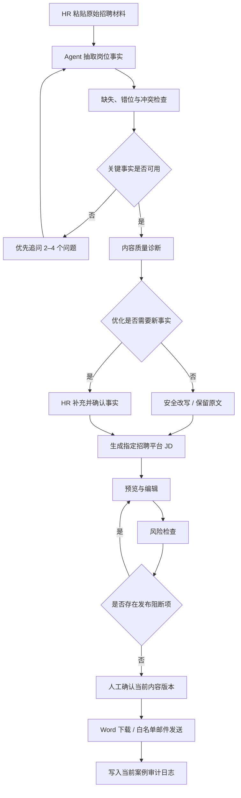

# 招聘协作 Agent 需求文档

> 文档类型：产品需求文档（PRD）
> 产品阶段：课程作业 / 可运行 Demo 最终版
> 版本：V1.0
> 日期：2026-08-12
> 实现载体：Python + Streamlit + OpenAI-compatible LLM + SQLite + SMTP

---

## 1. 一句话结论

本产品不是一个“输入岗位名称即可生成 JD”的文案工具，而是一个面向 HR 的招聘需求整理与发布决策 Agent：它将不完整、矛盾、散乱的招聘材料整理为已确认的岗位事实，在不虚构信息的前提下完成质量诊断、渠道化生成、风险检查、人工审批和实际输出。

---

## 2. 需求理解

### 2.1 原始作业要求

作业要求实现一个帮助 HR 编写并发布招聘 JD 的 Agent，基础要求包括：

1. 根据岗位信息生成招聘 JD。
2. 支持人工修改或确认内容。
3. 将 JD 发送至至少一个真实渠道。
4. Demo 展示一次完整的输入、Agent 处理、审核和输出流程。

作业的显性任务是“生成并发布 JD”，但用户真正的工作任务是：

> 将用人部门给出的散乱、不完整、可能互相矛盾的招聘需求，转化成一份内容准确、条件可验证、表达符合渠道特点、风险可控且可直接发布的 JD。

### 2.2 用户的核心痛点

| 痛点 | 具体表现 | 产品需要解决的问题 |
|---|---|---|
| 需求材料散乱 | 信息分散在聊天记录、旧 JD、会议笔记和口头描述中 | 自动抽取已知事实，减少 HR 重新填表 |
| 关键信息缺失 | 缺少岗位目标、职责产出、能力证据或薪资 | 识别缺失并优先追问当前最关键的问题 |
| 原始材料矛盾 | 同时出现多个城市、薪资范围或工作方式 | 在生成前暴露冲突，要求人工确认 |
| 岗位要求空泛 | “具备需求分析能力”“项目推进能力强”无法稳定筛选候选人 | 识别不可验证表达，要求 HR 补充场景、范围和结果 |
| 模型可能虚构 | 自行增加技术栈、薪资、福利、团队氛围或公司承诺 | 将岗位事实与文案表达分离，事实只能来自用户确认 |
| 多平台重复改写 | 不同招聘平台的结构、语气和篇幅不同 | 从同一份已确认内容生成渠道版本，不重新创造事实 |
| 发布风险难控 | 年龄、性别、婚育、强制加班、夸大承诺等表述可能被忽略 | 发布前检查，高风险内容硬阻断 |
| 修改与审批脱节 | 审批后内容被修改，但仍可下载或发送 | 审批必须与具体内容版本绑定 |

### 2.3 目标用户

**核心用户：HR / 招聘专员**

- 负责与用人部门沟通招聘需求。
- 负责整理、编辑、审核和发布 JD。
- 需要兼顾内容质量、渠道效率和发布风险。

**次要用户：用人经理**

- 提供岗位背景、目标、职责和能力要求。
- 对 Agent 提出的业务追问补充事实。
- 确认最终岗位定义是否符合真实用人需求。

**Demo 阶段不支持的用户类型：**多租户管理员、合规审批人、多人独立复核角色。

### 2.4 用户核心任务（JTBD）

> 当我收到一段不完整的招聘需求时，我希望系统能自动提取已知信息、找出缺失与矛盾、告诉我哪些表达不适合直接用于招聘，然后生成一份可编辑、可审核、可追溯、适配目标平台并能实际发送的 JD，从而减少来回沟通和人工改写，同时不让模型替我创造公司事实。

---

## 3. 产品判断

### 3.1 产品定位判断

这个产品应定位为“招聘需求治理与发布协作 Agent”，而不是“JD 写作器”。

理由如下：

1. **写作本身已经高度商品化。** 任意通用大模型都可以生成语句通顺的 JD，单纯润色没有足够产品壁垒。
2. **HR 最昂贵的不是打字时间，而是信息确认和跨部门沟通成本。** 产品必须提前发现缺失、冲突和不可验证要求。
3. **招聘文案包含可能影响候选人和企业的高风险事实。** 薪资、学历、工作地点、福利和任职门槛不能由模型自由发挥。
4. **真正可交付的结果是“可发布”，不是“已生成”。** 必须包含编辑、风险检查、审批、导出或发送。

### 3.2 Agent 形态判断

系统只有在以下行为真正发生时，才称得上 Agent：

- 主动从原始材料中抽取已知事实，而非要求用户重新填完所有字段。
- 主动发现缺失、错位、冲突和内容质量问题。
- 根据当前信息状态优先追问最关键的少量问题，而不是一次丢出所有缺失项。
- 判断哪些内容可以安全改写，哪些必须由 HR 补充新事实。
- 在用户修改关键事实后更新系统状态，使后续平台版本保持一致。
- 在高风险条件下阻止动作，而不是只生成一段风险提示。

### 3.3 事实控制判断

系统需要维护两层内容：

| 内容层 | 定义 | 可修改方式 |
|---|---|---|
| 岗位事实层 | 职位名称、地点、工作方式、薪资、经验、学历、岗位目标、职责、能力等已确认信息 | 只能通过用户输入、补充或显式确认更改 |
| 发布文案层 | 基于同一份事实组织的渠道表达、顺序、语气和篇幅 | 可由模型或确定性模板调整，但不得新增岗位事实 |

该设计决定了一个关键原则：

> 文案可以自动改，事实不能自动猜。

### 3.4 内容优化判断

“优化”必须拆分为两类：

1. **安全改写：**仅调整语序、动词和结构，不增加新事实，用户可一键采纳。
2. **需补充事实的增强：**必须追问场景、范围、对象或结果，系统不得擅自改成更具体的任职条件。

这是区分专业 Agent 与普通“文案润色 Demo”的分水岭。

### 3.5 风险与审批判断

- 风险系统的价值不在“能给分”，而在“能阻止什么”。
- 不展示没有统计依据的假精确风险分，而显示发布阻断项、人工核实项和文本优化项数量。
- 高风险项必须硬阻断审批、下载和发送。
- 当前 Demo 没有真实身份系统，因此不伪装“双人审批”。
- 审批对象必须是具体内容哈希；编辑、切换平台或更改薪资后，旧审批立即失效。

### 3.6 阶段性产品结论

当前版本已经能证明三件事：

1. 能将招聘任务拆成一条可执行的 Agent 工作流。
2. 能将 LLM 用于抽取、诊断和生成，同时用确定性规则控制事实与风险。
3. 能完成“真实输入→Agent 处理→人工确认→实际输出”的作业闭环。

它仍然不是可直接商业化的多用户招聘系统。缺失登录、用户和租户隔离、真实角色权限、持久化岗位数据、独立审批会话与可配置规则管理。

---

## 4. 产品目标与成功标准

### 4.1 产品目标

1. 降低 HR 从非结构化材料中整理招聘需求的成本。
2. 提前发现缺失、冲突、字段错位和内容质量问题。
3. 在不增加无来源事实的前提下生成渠道化 JD。
4. 使风险控制真正影响发布权限，而不是停留在提示层。
5. 保证审批、导出和发送对应同一个内容版本。

### 4.2 Demo 验收成功标准

| 目标 | 可观测成功标准 |
|---|---|
| 需求整理 | 粘贴一段原始需求后，系统能生成结构化字段，并保留已确认内容 |
| 主动澄清 | 系统一次最多展示 4 个优先问题，必填缺失和字段错位优先 |
| 事实安全 | 模型输出中的职位名称、地点、工作方式、薪资和岗位亮点不得覆盖结构化输入 |
| 质量诊断 | “具备需求分析能力”或“项目推进能力”等表述会触发可解释的追问，而不是被自动补写成新门槛 |
| 多渠道生成 | 同一份岗位内容可生成不同平台结构，切换后岗位事实不变 |
| 风险阻断 | 插入“30岁以下”等高风险表达后，审批、Word 下载和邮件发送不可用 |
| 版本审批 | 已审批 JD 被修改或切换渠道后，原审批自动失效 |
| 薪资变更 | “面议”被编辑为具体金额后，必须显式确认才能回写事实层并解除阻断 |
| 真实输出 | 通过审批的内容可导出有效 DOCX，并可发送到白名单邮箱 |
| 审计隔离 | 审计页只显示当前 `run_id` 事件，敏感元数据在界面中脱敏 |

---

## 5. 范围定义

### 5.1 当前版本范围（In Scope）

- 单浏览器会话中创建和重置招聘案例。
- 粘贴原始招聘需求、旧 JD 或聊天记录。
- AI 抽取结构化岗位信息，失败时进入明确标记的离线回退。
- 缺失、字段相关性和原材料冲突检查。
- 最多 4 个优先追问。
- 结构化字段的人工校对。
- 内容质量诊断、安全改写、事实补充与决策记录。
- 六种目标平台的 JD 生成与切换。
- JD 预览、草稿编辑、显式保存和取消。
- 关键薪资变更的检测、确认与状态同步。
- 发布前风险评估和高风险硬阻断。
- 与内容哈希绑定的人工审批。
- Word 导出、SMTP 邮件发送和收件人白名单。
- 当前案例级审计日志。

### 5.2 当前版本不包含（Out of Scope）

- 用户注册、登录、组织和多租户体系。
- 真实身份与角色权限验证。
- 真实的双人审批或多级审批流。
- 直连 BOSS 直聘、猎聘等平台的发布 API。
- 与 ATS、HRIS 或企业通讯录的系统集成。
- 多个岗位的持久化项目管理、搜索和版本库。
- 可配置的行业风险规则与法务工作台。
- 自动宣称风险检查等价于法律合规意见。

---

## 6. 核心工作流



### 6.1 状态流转

| 状态 | 进入条件 | 可执行动作 | 离开条件 |
|---|---|---|---|
| 待整理需求 | 新建案例 | 粘贴材料、载入示例 | 点击 Agent 整理 |
| 需求澄清中 | 已完成首次抽取 | 补充材料、确认建议、修改字段 | 必填事实可用且冲突已确认 |
| 可生成 | 完整性与字段相关性检查通过 | 选择平台、处理质量诊断、生成 | 生成成功 |
| 已生成，待复核 | 已产生最终文案 | 预览、编辑、切换平台、确认薪资变更、检查风险 | 高风险已清除且完成人工确认 |
| 已审批，可发布 | 审批人姓名与确认勾选有效，且无高风险 | 下载 Word、发送邮件 | 内容被修改、平台被切换或开始新案例 |

---

## 7. 功能需求

### 7.1 FR-01 案例与会话状态

**需求描述**

- 每个新案例必须生成唯一 `run_id`。
- 会话中必须保留原始材料、结构化字段、生成内容、草稿、审批哈希和审计事件。
- 点击“开始新案例”后，必须清空上一案例的内容、决策、审批和临时补充状态，并生成新 `run_id`。

**验收标准**

- 新建案例后 `run_id` 发生变化。
- 上一案例的 JD、草稿、审批、收件人和诊断决策不再出现。

### 7.2 FR-02 原始材料输入与抽取

**需求描述**

- 支持“Agent 智能整理”与“直接校对字段”两种入口。
- 智能整理入口支持粘贴招聘需求、旧 JD、聊天记录或会议笔记。
- 用户可在原始材料之后追加补充信息，再次运行整理。
- 抽取必须输出 `JobInput` 结构，不得补写原材料没有支持的岗位事实。
- 模型不可用或输出格式错误时，系统应进入离线回退模式，并在界面上明确显示，不得将回退结果伪装为 AI 结果。

**验收标准**

- 对包含“1-3 年产品经理经验”的旧 JD，系统能抽取经验为 `1-3年`。
- 原材料未提供部门或职级时，对应字段保持空值。
- 抽取后用户仍可修改任意结构化字段。

### 7.3 FR-03 岗位事实结构

| 字段 | 要求级别 | 内容规则 |
|---|---|---|
| 岗位名称 | 必填 | 只填具体职位，不填地点、薪资或职责段落 |
| 所属部门 | 可选 | 只填部门、中心或业务团队 |
| 工作地点 | 必填 | 只填城市、国家或具体区域 |
| 工作方式 | 可选 | 待确认、现场办公、混合办公、远程办公 |
| 职级 | 可选 | 如初级、高级、资深或 P7 |
| 经验要求 | 建议填写 | 只填工作年限或经验类型 |
| 学历要求 | 建议填写 | 只填学历或学位 |
| 薪资范围 | 建议填写 | 金额、计薪周期或“面议” |
| 岗位目标 | 必填 | 描述岗位需要实现的核心业务结果 |
| 主要职责 | 必填 | 使用负责、推动、建立、交付等动词描述任务与产出 |
| 必备能力 | 必填 | 候选人入职前应具备的能力、经验、工具或可验证成果 |
| 加分能力 | 可选 | 额外相关经验或能力 |
| 岗位亮点 | 建议填写 | 只能使用真实的成长、项目、团队或业务亮点 |
| 招聘平台 | 必填 | 必须在已支持平台范围内 |

### 7.4 FR-04 完整性、相关性与冲突检查

**完整性检查**

- 必填项缺失时禁止生成。
- 建议项缺失时给出补充建议，但不一定阻断生成。

**字段相关性检查**

- 工作地点中不得接受学历、经验、薪资或职位名称。
- 学历要求中不得接受地点、工作年限或薪资。
- 薪资字段必须包含金额、计薪周期语义或“面议”。
- 主要职责需表达入职后的工作动作，必备能力需表达入职前的经验或能力。

**原始材料冲突检查**

- 同时出现多个薪资范围。
- 同时出现多种工作方式。
- 同时出现“应届 / 经验不限”和高年限要求。
- 同时出现“学历不限”和具体学历门槛。
- 同时出现多个工作城市。

**验收标准**

- 冲突存在时，必须由用户勾选已人工核对，否则生成按钮不可用。
- 字段错位时，页面显示具体错误和对应补充问题。

### 7.5 FR-05 主动澄清

- 系统每次最多展示 4 个追问，避免让用户再次面对一张完整长表单。
- 优先级从高到低为：必填字段错位→必填缺失→任职要求质量问题→建议字段错位→建议字段缺失。
- 当原文中有明确线索但模型未抽取岗位目标时，系统可给出“可能的岗位目标”，但必须等待用户确认，不得直接认定为事实。

### 7.6 FR-06 内容质量诊断与优化

**诊断类型**

| 类型 | 判断示例 | 系统动作 |
|---|---|---|
| 表述空泛 | “具备项目推进能力” | 询问项目阶段、协作对象、责任范围和结果 |
| 不可验证 | “具备需求分析能力”“抗压能力强” | 询问可通过简历或面试验证的经历和成果 |
| 职责与要求混淆 | 必备能力以“负责、推动、规划”开头 | 询问该内容是入职后任务，还是候选人必须证明做过的经历 |
| 缺少预期产出 | 职责只描述动作，没有交付结果 | 询问最终需要交付的产品方案、机制、上线版本或效果复盘 |
| 高级岗位责任边界不明 | 高级 / 资深岗位没有指标、业务链路或责任范围 | 要求补充责任边界 |
| 安全改写 | 仅需调整语序、动词或并列关系 | 提供可一键采纳的 `safe_rewrite` |

**交互要求**

- 每个问题展示原文、问题类型、原因、建议追问或安全改写。
- 需要新事实时，用户必须填写“HR 已确认的补充事实”，系统才能写回结构化字段。
- 用户可选择采纳改写、使用补充内容或保留原文。
- 每次决策需写入审计事件，记录问题 ID、字段、类型、决策以及修改前后哈希。

### 7.7 FR-07 JD 生成与事实约束

**生成条件**

- 所有必填字段非空。
- 不存在字段相关性错误。
- 原材料冲突不存在，或用户已确认人工核对。

**生成要求**

- 模型需使用结构化 JSON Schema 输出 `JDContent`。
- 岗位职责尽量使用动词开头，任职要求尽量可验证。
- 不得自行添加技术栈、团队规模、业务指标、福利、公司地位或营销性判断。
- 生成后强制用已确认的职位名称、地点与工作方式、薪资与岗位亮点覆盖模型对应字段。
- 模型失败时应保留可执行流程，但需明确标记回退原因与生成方式。

### 7.8 FR-08 招聘平台适配

| 平台 | 内容特点 |
|---|---|
| BOSS直聘 | 简短直接，优先呈现真实薪资、地点、核心职责和沟通邀请 |
| 猎聘 | 面向中高端人才，强调职位使命、业务影响和可验证成果 |
| 智联招聘 | 标准完整，清晰区分岗位概述、职责、要求、加分项和亮点 |
| 前程无忧 | 正式稳健，完整表达职责、任职资格和工作条件 |
| 拉勾招聘 | 面向互联网、产品和技术岗，强调团队协作、产品阶段和业务挑战 |
| 公司官网 | 信息最完整、表达最正式，兼顾岗位价值和有依据的雇主信息 |

**平台切换原则**

- 使用同一份 `generated_content` 作为 canonical 内容。
- 平台切换通过确定性渲染调整结构，不重新调用模型，不增加新事实。
- 生成新平台文案后，旧审批必须失效。

### 7.9 FR-09 预览、草稿与编辑

- 结果页提供“预览 / 编辑”切换。
- 进入编辑时，必须将当前正式内容复制到独立 `jd_draft`，不可将编辑框直接绑定已生成内容。
- 只有点击“保存修改”才替换正式内容；点击“取消”应放弃草稿。
- 空白 JD 不得保存。
- 保存修改后，原审批立即失效，并记录修改前后内容哈希。

### 7.10 FR-10 关键薪资变更

- 系统需识别 JD 中的具体薪资金额和范围，包含 K、千、万、元、人民币、美元、港币、计薪周期和“·14薪”等形式。
- 当正式 JD 中的具体薪资与已确认岗位事实不同时，必须生成“薪资事实待确认”发布阻断项。
- 页面需展示原已确认薪资和 JD 中新薪资。
- 只有点击“确认更新薪资”后，才能同步更新 `generated_job`、输入字段、canonical 内容与当前 JD。
- 确认薪资变更后，原审批失效，并写入审计事件。

### 7.11 FR-11 风险检查与发布门禁

**风险级别**

| 级别 | 产品语义 | 系统动作 |
|---|---|---|
| 高 | 发布阻断项 | 禁止审批、下载和发送 |
| 中 | 人工核实项 | 显示问题、原因和建议，允许人工判断 |
| 低 | 文本优化项 | 显示改进建议，不单独阻断 |

**重点检查范围**

- 年龄限制：`32岁以下`、`年龄不超过38岁`、`90后优先`、`年轻人优先`等。
- 性别和婚育限制。
- 与岗位能力无关的户籍、身高或外观限制。
- 强制无偿加班等不合理表述。
- 保证晋升、保证加薪、绝不裁员等过度承诺。
- 未在原始事实中出现的福利、公司身份和营销性表述。
- 职责与要求重复、工作方式错放在任职要求、经验与职级矛盾。
- 明显占位符、重复用词和模糊表达。
- 关键结构缺失：没有职责或任职要求章节。

**展示要求**

- 页面显示“发布阻断项、人工核实项、文本优化项”数量。
- 每个问题显示类别、命中文本、原因和修改建议。
- 不显示未经校准的“风险分 /100”。

### 7.12 FR-12 人工审批与版本绑定

- 审批前必须填写主审批人姓名，并勾选已核对原始需求、JD 事实、风险提示和收件人。
- 存在高风险时，审批按钮必须禁用。
- 审批成功时将当前 JD 的 SHA-256 内容哈希记录为 `approved_hash`。
- 只有 `approved_hash == content_hash(jd_text)` 且无高风险时，审批才有效。
- 任何编辑、平台切换或关键事实变更都必须清空旧审批。

### 7.13 FR-13 Word 导出与邮件发送

**Word 导出**

- 只有审批有效时显示下载入口。
- 生成有效 DOCX 文件，标题、二级标题和编号列表需保留基本层级。
- 文件名包含岗位名称与当前平台。

**邮件发送**

- 只有审批有效时允许发送。
- 必须配置 SMTP 主机、端口、用户名、授权密码和发件人。
- 收件人必须在 `ALLOWED_RECIPIENTS` 白名单中；未配置白名单时系统拒绝发送。
- 邮件主题应包含“人工审核完成”和岗位名称，并附加最终 Word。
- 发送成功和失败均需写入审计日志。

### 7.14 FR-14 审计日志

- 审计日志存储事件时间、事件类型、`run_id` 和 JSON metadata。
- 界面查询必须以当前 `run_id` 过滤，不得显示其他案例的记录。
- 审批人、收件人、邮件回执和错误详情在界面展示时必须脱敏。
- 建议覆盖事件：内容优化决策、JD 生成、模型回退、编辑、平台版本生成、薪资事实确认、审批、Word 下载、邮件成功和失败。

---

## 8. 信息架构与页面要求

### 8.1 页面结构

| 一级区域 | 主要内容 | 用户目标 |
|---|---|---|
| 侧边栏 | 当前案例 ID、流程状态、开始新案例 | 随时理解当前状态 |
| ① 需求澄清 | 原始材料、追问、冲突、结构化字段、质量诊断、生成前确认 | 得到可用的岗位事实 |
| ② 生成、复核与发布 | 平台切换、预览 / 编辑、薪资确认、风险门禁、审批、下载、发送 | 得到并输出可发布版本 |
| ③ 当前案例审计 | 当前 `run_id` 的脱敏事件 | 追溯关键决策和动作 |

### 8.2 交互原则

1. 页面以“阶段任务”组织，不将所有操作堆在一张长表单中。
2. 关键状态变化后自动进入相应阶段，例如生成成功后进入结果页。
3. 进行模型调用时展示处理中反馈。
4. 所有阻断必须告诉用户“为什么被阻断”和“下一步怎么做”。
5. 危险操作不依赖单纯提示，必须用按钮禁用或状态门禁实际限制。

---

## 9. 数据与状态设计

### 9.1 核心数据对象

| 对象 | 作用 |
|---|---|
| `JobInput` | 保存结构化岗位事实 |
| `JDContent` | 保存平台无关的 canonical JD 内容 |
| `FieldIssue` | 表示字段错位、原因和追问 |
| `ContentIssue` | 表示内容质量问题、安全改写或补充问题 |
| `OptimizationDecision` | 记录采纳、保留或待处理决策 |
| `RiskIssue` / `RiskAssessment` | 保存发布前风险问题与总体级别 |
| `audit_log` | 按 `run_id` 记录关键事件和元数据 |

### 9.2 关键状态约束

- `jd_text`：当前正式版本。
- `jd_draft`：编辑中草稿，未保存时不影响正式版本。
- `generated_job`：生成时已确认的岗位事实快照。
- `generated_content`：不同平台共用的 canonical 内容。
- `approved_hash`：最后一次审批的 JD 内容哈希。
- 审批有效性不可仅依赖界面按钮状态，必须重新校验风险级别和内容哈希。

---

## 10. 非功能需求

### 10.1 安全与隐私

1. API Key、SMTP 授权码和白名单必须使用环境变量或 Streamlit Secrets，不得写入 GitHub。
2. `.env`、虚拟环境、本地数据库和导出 Word 必须被 `.gitignore` 排除。
3. 审计界面不展示完整收件人、审批人、邮件回执和服务器错误详情。
4. 邮件发送必须使用收件人白名单，公开 Demo 不得成为任意邮件发送器。
5. 高风险门禁和审批有效性必须在服务端逻辑中重新校验，不得仅依赖前端控件禁用状态。

### 10.2 可靠性

- 模型调用失败时不得导致整个 Demo 不可操作。
- 当模型错误可识别时，系统应将网关无通道、密钥无效、限流、连接超时和 Schema 不兼容转换为可操作提示。
- 审计事件失败不得泄露密钥或完整服务器错误。

### 10.3 性能与反馈

- 页面应先渲染主要结构，慢操作使用明确的加载状态。
- 平台切换不应再次调用模型，以降低延迟、费用和事实漂移。
- 涉及编辑的相关字段需在 Streamlit rerun 间保持一致。

### 10.4 可测试性

- 核心工作流逻辑应与 Streamlit UI 分离，可通过单元测试直接验证。
- UI 至少需覆盖生成后跳转、草稿保留、编辑使审批失效、高风险阻断、薪资事实确认、新案例清空和审计隔离。
- 测试不得依赖真实模型、真实 SMTP 或公网稳定性。

---

## 11. 执行思路

### 11.1 总体技术思路

采用“LLM 处理非结构化理解，确定性代码管理事实、风险和流程”的混合架构。

```text
原始文本
  ↓
LLM / 回退抽取器
  ↓
Pydantic 结构化岗位事实
  ↓
确定性完整性、相关性与冲突检查
  ↓
规则 + 结构化内容诊断
  ↓
LLM 生成 canonical JD
  ↓
事实强制覆盖
  ↓
确定性平台渲染
  ↓
规则风险门禁 + 人工审批
  ↓
DOCX / SMTP / SQLite 审计
```

### 11.2 为什么不采用“一次大模型调用完成全部任务”

- 单次调用无法稳定保证薪资、地点、福利等关键事实不漂移。
- 单次调用很难区分“安全改写”与“新增事实”。
- 单次调用无法构成稳定的发布权限门禁。
- 单次调用不利于将用户的确认、拒绝和修改记录为可追溯决策。

### 11.3 模块化实施

| 模块 | 职责 | 实现原则 |
|---|---|---|
| `schemas.py` | 定义岗位事实、JD、质量问题和风险对象 | 所有跨模块数据使用明确 Schema |
| `workflow.py` | 抽取、完整性、相关性、质量诊断、生成、平台渲染和风险评估 | 业务规则独立于 UI，便于测试 |
| `app.py` | 页面阶段、会话状态、用户决策和门禁交互 | 使用 Streamlit Session State 维护单会话状态 |
| `storage.py` | 审计事件持久化与按案例查询 | 必须按 `run_id` 过滤 |
| `exporter.py` | 将最终 Markdown JD 转换为 DOCX | 只接收已审批文本 |
| `emailer.py` | 将 JD 与 Word 附件发送到指定邮箱 | 白名单、完整 SMTP 配置和 TLS |

### 11.4 实施优先级

**P0：可用、不丢数据、不越过风险门禁**

1. 草稿与正式 JD 分离，编辑显式保存。
2. 审批与内容哈希绑定。
3. 高风险硬阻断下载和发送。
4. 审计日志按当前案例隔离。
5. 关键事实变更需显式确认。

**P1：体现 Agent 的理解和判断价值**

1. 非结构化需求抽取。
2. 优先追问与冲突识别。
3. 内容质量诊断。
4. 安全改写与需事实增强的分类。
5. 多渠道确定性渲染。

**P2：从 Demo 走向可试用产品**

1. 登录、用户、组织与权限。
2. 服务端持久化的岗位、版本和决策记录。
3. 独立审批会话和真实多人审批。
4. ATS / HRIS / 招聘平台 API 集成。
5. 规则版本管理和可配置风险策略。

---

## 12. 测试与验收计划

### 12.1 业务逻辑测试

- 必填缺失和字段错位。
- 年龄、性别、婚育和强制加班规则。
- 职级与经验矛盾。
- 职责与任职要求重复。
- 不同平台生成结构不同且事实一致。
- 模型幻觉的地点、薪资和亮点被已确认事实覆盖。
- 非结构化 JD 中的经验年限可被识别。
- 空泛需求触发追问，具体可验证需求不误报。
- 从“面议”修改为具体薪资后需显式确认。

### 12.2 Streamlit UI 回归测试

- 生成后自动进入结果阶段。
- 侧边栏状态变为“已生成，待复核”。
- 从预览切换到编辑时完整内容不丢失。
- 保存编辑后旧审批失效。
- 高风险内容不能审批和下载。
- 确认薪资变更后结构化事实、canonical 内容和当前 JD 同步，之后可重新审批。
- 新案例清空旧状态。
- 审计页不显示其他 `run_id` 的数据。

### 12.3 发布前检查

1. 所有自动化测试通过。
2. `.env`、`secrets.toml`、本地数据库和导出文件未进入 Git。
3. Streamlit 依赖版本锁定。
4. 公开应用可在未登录浏览器中打开。
5. Streamlit Secrets 中的 LLM 和 SMTP 变量名与程序一致。
6. 公开 Demo 的 `ALLOWED_RECIPIENTS` 只包含测试邮箱。

---

## 13. 产品指标建议

当前 Demo 不应伪造真实业务指标。如进入试用阶段，建议埋点以下指标：

### 13.1 效率指标

- 从粘贴原始需求到首次生成 JD 的中位时长。
- 每个岗位需要的人工字段修改次数。
- 每个岗位从生成到审批的平均轮次。
- 平台版本生成与人工改写耗时对比。

### 13.2 质量指标

- 首次抽取字段的用户直接保留率。
- 内容质量问题中的补充、采纳和保留比例。
- 生成后无来源新事实的检出数量。
- 高风险命中后的修改完成率。
- 最终审批版本的人工编辑幅度。

### 13.3 结果指标

- 完成有效审批的岗位占比。
- 完成 Word 导出或邮件发送的岗位占比。
- 不同平台版本的实际使用分布。

---

## 14. 风险、局限与对策

| 风险 | 当前表现 | 对策 |
|---|---|---|
| 模型抽取错误 | 长 JD 或复杂排版可能造成错误抽取 | 结构化校对、缺失检查、显式确认和回归用例 |
| 模型幻觉 | 可能增加无来源的技术栈、福利或营销词 | 关键事实强制覆盖、提示词约束和发布前真实性规则 |
| 规则漏报 | 正则不能理解所有语义变体 | 保留人工审核；后续加入语义评估和规则版本管理 |
| 规则误报 | 无上下文正则可能误判合理表述 | 展示命中文本、原因和建议；中低风险保留人工判断 |
| 公开 Demo 滥用 | 邮件和模型调用可被外部用户反复触发 | 收件人白名单、限流、额度和监控；必要时关闭公开邮件功能 |
| 审计数据持久性弱 | Streamlit 本地 SQLite 可随实例重建丢失 | 商业化时迁移至服务端关系数据库 |
| 无真实身份 | 审批人姓名只是文本输入 | 当前不伪装双人审批；后续接入 SSO 和角色权限 |
| 依赖第三方网关 | 模型通道、配额或 Schema 支持可能变化 | 显式回退、可操作错误信息和可替换的 LLM client |

---

## 15. 后续路线图

### V1.1：可观测与评估

- 为抽取字段增加原文证据与状态：`extracted / inferred / confirmed / missing / conflicted`。
- 增加原文→修改→修改理由对照。
- 为模型、提示词和风险规则增加版本字段。
- 增加生成耗时、失败类型和回退率监控。

### V1.2：岗位与版本管理

- 岗位列表、搜索、复制和归档。
- 事实版本、渠道文案版本和审批版本分离。
- 修改差异对比与回滚。
- 外部数据库持久化。

### V2.0：企业协作

- 用户、组织、租户、角色和 SSO。
- 用人经理、HR 和合规人员的独立任务与审批会话。
- 高风险例外流程、真实双人审批和权限验证。
- ATS / HRIS / 招聘平台与企业通讯渠道集成。
- 组织级词库、模板、品牌语气和风险规则管理。

---

## 16. Demo 答辩叙事

### 16.1 建议演示脚本

1. **展示非结构化输入：**粘贴一段包含已知信息和空泛要求的旧 JD。
2. **展示 Agent 整理：**说明系统抽取了哪些岗位事实，没有凭空补齐部门或职级。
3. **展示主动判断：**系统识别“具备项目推进能力”缺乏范围和结果，只提问而不擅自写成更高门槛。
4. **展示人机协作：**补充 HR 已确认的场景和成果，写回结构化字段。
5. **展示渠道化生成：**生成 BOSS 直聘版，再切换猎聘版，说明事实不变、只变表达。
6. **展示事实变更：**将“面议”改为具体薪资，系统先阻断，再通过 HR 显式确认同步事实。
7. **展示风险门禁：**加入“30岁以下”，审批和下载立即不可用；删除后恢复。
8. **展示真实闭环：**人工确认当前版本，下载 Word，发送至白名单邮箱，最后打开审计日志。

### 16.2 答辩核心表达

> 我没有把这道题理解为“调用一次大模型写 JD”。那个能力本身已经非常普通。我把它定义为一个招聘协作 Agent：先整理事实，再发现缺失、矛盾和不可验证要求；可以安全改写的才自动改，需要新事实的必须追问 HR；最后通过风险门禁、内容版本审批和真实输出完成闭环。大模型负责理解和表达，确定性代码负责事实、风险和发布权限。

---

## 17. 最终产品结论

招聘协作 Agent 的核心价值不是“比 HR 更会写文案”，而是“更早地发现需求问题，更严格地控制事实，更低成本地产出多渠道结果，并使发布决策可追溯”。

对当前作业阶段而言，最有说服力的不是界面美化或模型名称，而是三个可观测的产品决策：

1. 系统发现空泛要求后不自行编造更具体的门槛，而是追问 HR。
2. 系统发现高风险内容后真正阻止发布，而不是只弹出提示。
3. 系统将审批绑定到具体内容版本，任何修改都要重新确认。

这三点共同说明：当前产品已经从“LLM 写作页面”前进为“具有主动澄清、事实控制、风险判断和人机协作闭环的 Agent Demo”。
